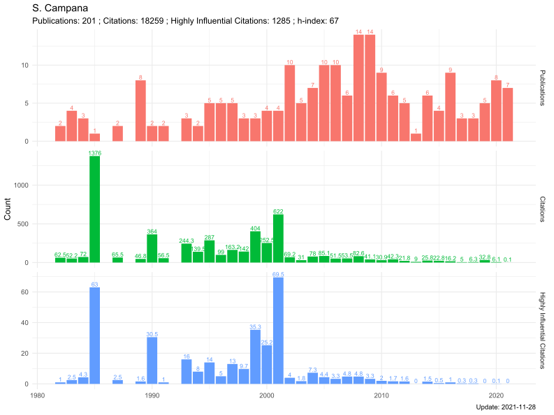

# S2miner
This **S2miner** (**S**emantic **S**cholar **M**ining) package helps users to extract, analyze and visualize scholarly data from [Semantic Scholar API](https://www.semanticscholar.org/product/api), thus providing new insight into bibliometrics study. 

**Note**: You can use the [Semantic Scholar API](https://www.semanticscholar.org/product/api) endpoint up to 100 requests per 5 minutes to test your application idea. To access a higher rate limit, complete the form to request authentication for your project. Authenticated partners have access to higher rate limits, personalized support, and co-marketing opportunities.


## :arrow_double_down: Installation


Install development versions from GitHub with:
```r
library(devtools)
install_github("Otoliths/S2miner",build_vignettes = TRUE)
```
## :beginner: Example

##### Load the **S2miner** package
```r
library("S2miner")
```

##### Searching For Papers By Keyword
```
# Supports AND and OR and inclusion and exclusion of terms, for example "title=bibliometrics" or "+Epidemic+Modeling+Canada-COVID".See blog post https://medium.com/ai2-blog/building-a-better-search-engine-for-semantic-scholar-ea23a0b661e7 for a description of our search relevance algorithm.
res1 <- search_papers(keyword = "bibliometrics",fields = c("title","abstract","authors"))

res1[["data"]]
```


##### Paper Lookup
```
# This function fetch a paper data from the Semantic Scholar corpus.
# Supported paper identifier services: Semantic Scholar ID, Semantic Scholar numerical ID, Digital Object Identifier, arXiv.rg, Microsoft Academic Graph, Association for Computational Linguistics, PubMed/Medline, PubMed Central and URL from one of the sites listed below. See Format for detalis.
res2 <- lookup_paper(paper_id = "649def34f8be52c8b66281af98ae884c09aef38b")

# get abstract
print(res2[["abstract"]])

# Too Long; Didn't Read.Artificial Intelligence summarizes academic articles for you.
print(res2[["tldr"]][["text"]])
```

##### Author Lookup
```
# This function fetch an author data from the Semantic Scholar corpus.
res3 <- lookup_author(author_id = "48980001")

# Show author profile plot
res3$plot
```


##### Traversing the Literature Graph
```
# Traversing the literature graph of an author's papers
res4 <- traverse_author(author_id = "48980001",fields = c("title","abstract","authors","year"))
res4[["data"]]

# Traversing the literature graph of a paper's informatio
res5 <- traverse_paper(paper_id = "649def34f8be52c8b66281af98ae884c09aef38b")
res5[["data"]]

```

##### Explore connected papers in a visual graph
```
browse_cp('9397e7acd062245d37350f5c05faf56e9cfae0d6',"s2")

```


## :heart: Contribution

Literature Graph visualization is under development. In addition, [Connected Papers](https://www.connectedpapers.com) is a unique, visual tool to help researchers and applied scientists find and explore papers relevant to their field of work. Future versions try to access network graph data.
Contributions to this package are welcome. 
The preferred method of contribution is through a GitHub pull request. 
Feel also free to contact us by creating [**an issue**](https://github.com/Otoliths/S2miner/issues).

